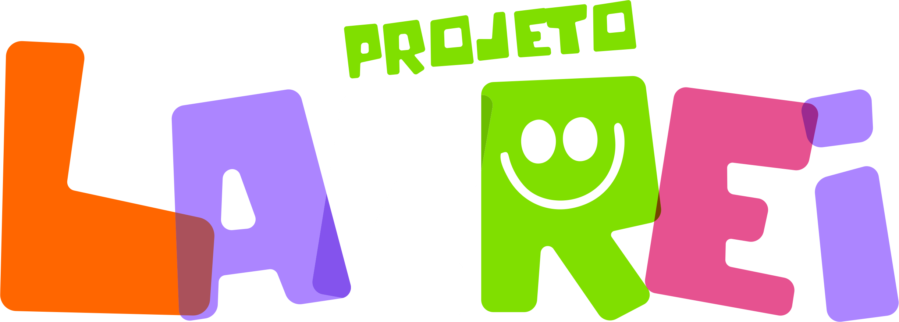

# Projeto Lacrei

### O Projeto Lacrei é um projeto desenvolvido pela APAE (Associação de Pais e Amigos dos Excepcionais) sem fins lucrativos onde o principal objetivo do projeto é transformar Lacres em acessibilidade para

## Como funciona o Projeto Lacrei?

1. Arrecadação: Pessoas e instituições se mobilizam para coletar lacres de alumínio. Pontos de coleta podem ser estabelecidos em escolas, empresas, condomínios, etc.

2. Armazenamento: Os lacres são armazenados em Caixas personalizadas, o que facilita o transporte e a contabilização.

3. Venda: Quando uma quantidade considerável de lacres é acumulada, eles são vendidos para empresas de reciclagem.

4. Reversão em Acessibilidade: O dinheiro arrecadado é utilizado para adquirir equipamentos de acessibilidade que são doados a pessoas com deficiência que necessitam.

## Tecnologias utilizadas no projeto:

- HTML
- CSS
- Javascript
- React

# Links:

- github.pages.io/lacrei

# Linkedin:

- [Alleson Sales](https://www.linkedin.com/in/allesonsales/)
